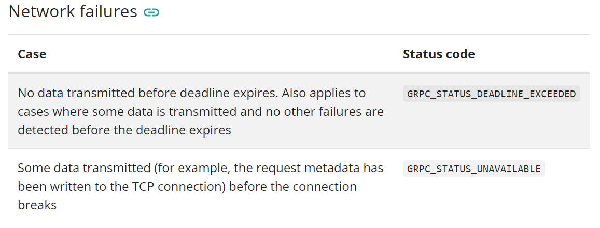
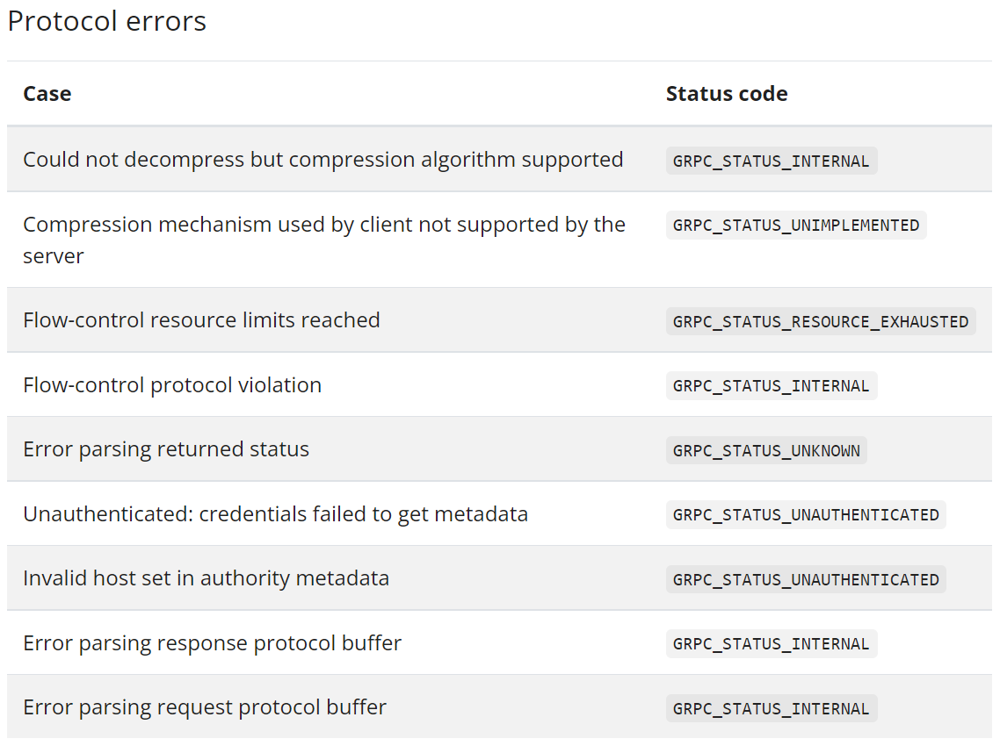

# gRPC Golang Master Class

section 09 gRPC Advanced Features Deep Dive

## Errors in gRPC

#### Error Codes

- It is common for API to sometimes return error code

- Http has many error codes

- While HTTP codes are standardized they're not usually clear

- gRPC has a few error codes

  - [grpc 공식 문서 error](https://www.grpc.io/docs/guides/error/)
  - [golang grpc error](https://avi.im/grpc-errors/#go)

  

  

  

### Client

```go
func doErrorCall(c calculatorpb.CalculatorServiceClient, n int64) {
	response, err := c.SquareRoot(
		context.Background(),
		&calculatorpb.SquareRootRequest{Number: n})
	if err != nil {
		respErr, ok := status.FromError(err)
		if ok {
			// actual error from gRPC (user error)
			log.Println(respErr.Message())
			log.Println(respErr.Code())
			if respErr.Code() == codes.InvalidArgument {
				log.Println("Negative Number Error")
				return
			}
		} else {
			// severe error
			log.Fatalf("Severe Error calling SquareRoot: %v", err)
			return
		}
	}
	log.Printf("Result of square root of %v : %v\n", n, response.GetResult())
}
```


### Server 

```go
	if number < 0 {
		return nil, status.Errorf(
			codes.InvalidArgument, fmt.Sprintf("Received a negative number %v", number))
	}
```


## gRPC Deadlines

- Deadlines allow gRPC clients to specify how long they are willing to wait for an RPC to complete before the RPC is terminated with the error DEADLINE_EXCEEDED
- The gRPC documentation recommends set a deadline for all client RPC calls 

- The server should check if the deadline has exceeded and cancel the work it is doing

- [gRPC Deadline](https://grpc.io/blog/deadlines/)

### Server

```go
	for i := 0; i < 3; i++ {
		if ctx.Err() == context.Canceled {
			log.Println("The client canceled the request")
			return nil, status.Error(codes.Canceled, "the client canceled the request")
		}
		time.Sleep(1 * time.Second)
	}
```

### Client

```go
	ctx, cancel := context.WithTimeout(context.Background(), timeout)
	defer cancel()

	res, err := c.GreetWithDeadline(ctx, req)
	if err != nil {
		statusErr, ok := status.FromError(err)
		if ok {
			if statusErr.Code() == codes.DeadlineExceeded {
				log.Fatalln("Timeout was hit. Deadline was exceeded")
			} else {
				log.Fatalf("unexpected error: %v\n", statusErr)
			}
		} else {
			log.Fatalf("error while calling Greet RPC: %v", err)
		}
		return
	}
	log.Printf("Response from Greet: %v", res.Result)
```


## SSL Encryption in gRPC

- In production gRPC calls should be running with encryption enabled
- This is done by generating SSL certificates
- SSL allows communication to be secure end-to-end and ensuring no Man in the middle attack can be performed 


### The need for SSL Encryption

- SSL allows clients and servers to encrypt packet 

- SSL enables clients and servers to securely exchange data

- Routers cannot view the content of the internet packets

  

### What is SSL?

- TLS (Transport Layer Security) encrypts the connection between 2 endpoints for secure data exchange 
- https is based on SSL certificates
- Two ways of using SSL 
  - 1 way verification browser => WebServer
  - 2 way verification SSL authentication 

### Server

```go
	tls := true
	var opts []grpc.ServerOption
	if tls {
		certFile := "ssl/server.crt"
		keyFile := "ssl/server.pem"
		cred, sslErr := credentials.NewServerTLSFromFile(certFile, keyFile)
		if sslErr != nil {
			log.Fatalf("Failed loading certificates: %v\n", sslErr)
			return
		}
		opts = append(opts, grpc.Creds(cred))
	}

	s := grpc.NewServer(opts...)
```


### Client

```go
	tls := true
	opts := grpc.WithInsecure()
	if tls {
		certFile := "ssl/ca.crt" // Certificate Authority Trust certificate
		creds, sslErr := credentials.NewClientTLSFromFile(certFile, "")
		if sslErr != nil {
			log.Fatalf("Error while loading CA trust certificate: %v", sslErr)
			return
		}
		opts = grpc.WithTransportCredentials(creds)
	}

	cc, err := grpc.Dial("localhost:50051", opts)
	if err != nil {
		log.Fatalf("Could not connect: %v", err)
	}
```

